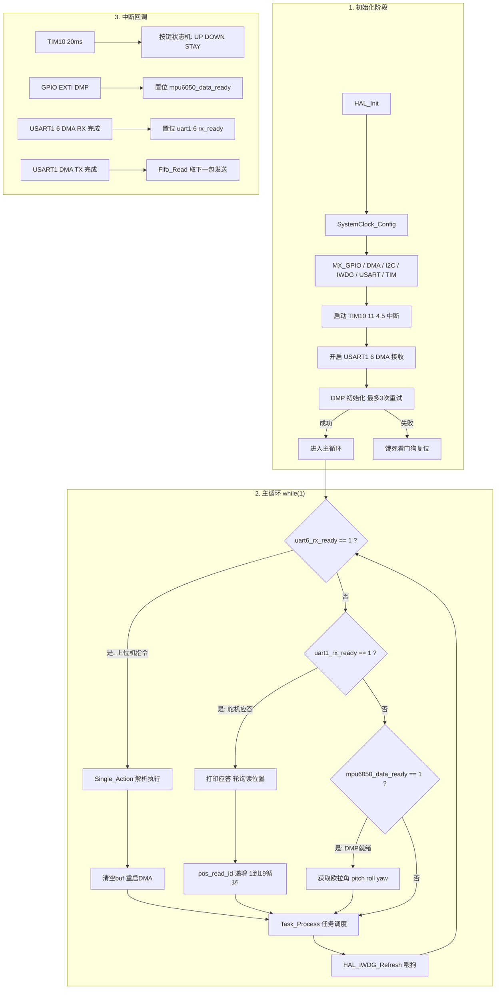
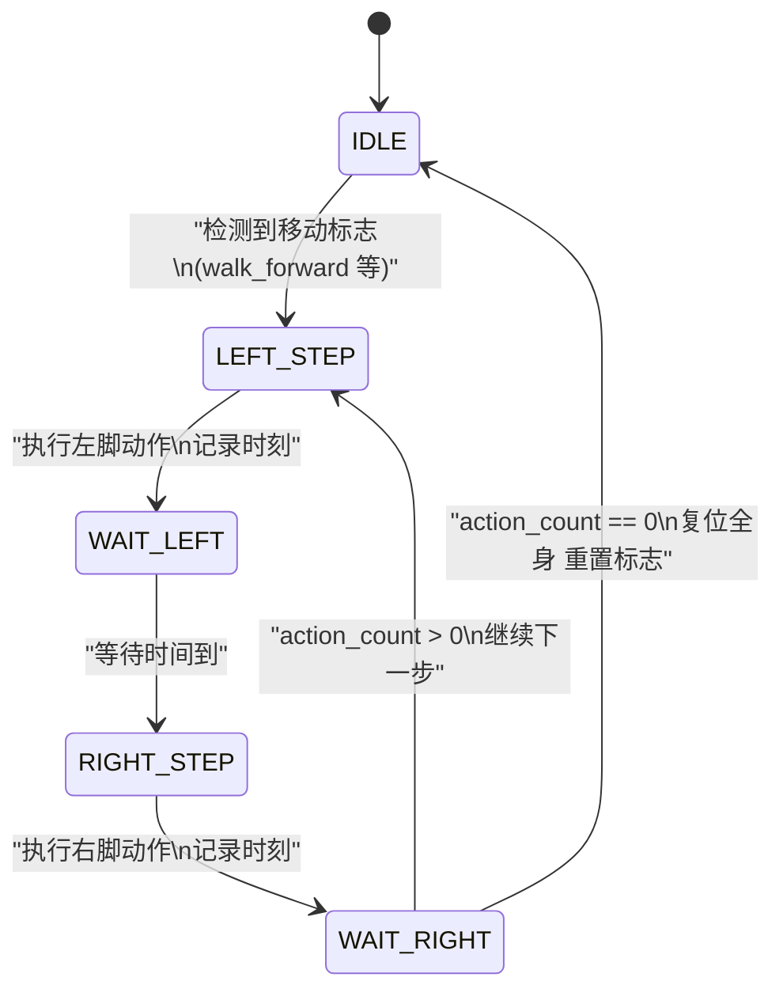
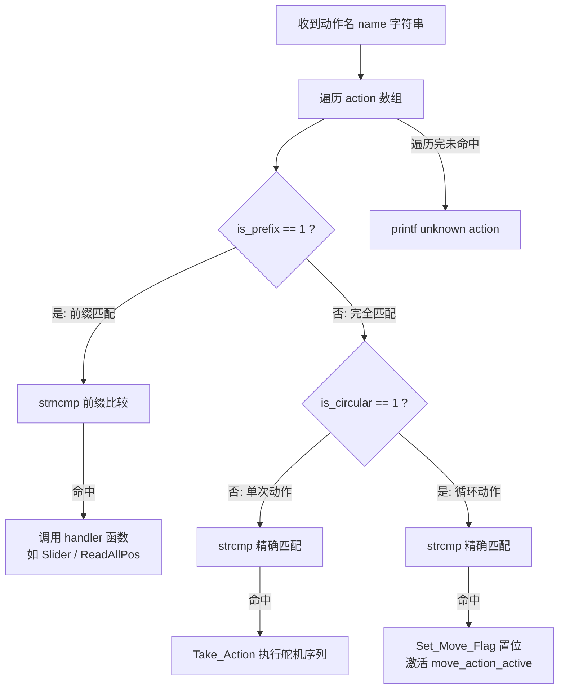

# 代码逻辑联合分析：main.c + Task + LX-16A + Single_action

> 生成时间：2026-07-15 | 项目：STM32F4 FreeRTOS 舞蹈机器人

## 概述

该项目是一个基于 STM32F4 的 18 自由度舞蹈机器人控制系统。4 个模块的分工如下：

- **main.c**：系统入口，负责硬件初始化、主循环事件分发、中断回调处理
- **Task.c**：表驱动的合作式调度器 + 移动步态状态机
- **LX-16A.c**：LX-16A 舵机通信协议层 + DMA 发送 FIFO
- **Single_action.c**：动作数据表 + 指令解析（支持单次动作、循环动作、前缀匹配）

## 系统级控制流（Mermaid）

## Task.c — 移动步态状态机

## Single_action.c — 指令解析流程

## 逻辑分析说明

系统采用**事件驱动 + 时间触发合作式调度**混合架构。主循环轮询 3 个事件标志（上位机指令、舵机应答、MPU 数据）并通过 `Task_Process()` 驱动移动步态状态机。外设通信全部使用 DMA 减少 CPU 占用，舵机发送通过 FIFO 缓冲实现流水线发送。

Task.c 的状态机设计规范，五状态（IDLE/LEFT_STEP/WAIT_LEFT/RIGHT_STEP/WAIT_RIGHT）覆盖完整生命周期，有 clear 的退出路径。Single_action 的表驱动设计可扩展性好，新增动作只需在 `action[]` 数组中添加条目。

---

## 逻辑问题

| 编号 | 严重程度 | 位置 | 问题描述 | 潜在影响 |
|---|---|---|---|---|
| **BUG-001** | 🔴 严重 | `LX-16A.c:95-96` + `main.c:311-313` | **FIFO 竞态条件**：`fifo.head`（Fifo_Write 在 main 循环中写）和 `fifo.tail`（Fifo_Read 在 `HAL_UART_TxCpltCallback` ISR 中写）并发访问同一结构体，无 volatile 也无临界区保护 | 高负载下 FIFO 状态不一致，导致丢包或重复发送 |
| **BUG-002** | 🔴 严重 | `main.c:194` | **ISR 中调用 printf**：`HAL_UARTEx_RxEventCallback`（DMA 接收完成中断回调）中调用 `printf`，最终触发阻塞式 `HAL_UART_Transmit`（见 `fputc` main.c:302）。阻塞超时设为 `0xFFFF`（约 65 秒 @ 9600bps） | USART6 上位机断连时 ISR 被长时间阻塞，导致 DMA 中断堆积、主循环饿死触发看门狗复位 |
| **BUG-003** | 🟠 警告 | `LX-16A.c:92` | **Servo_ReadPos 绕过 FIFO**：直接调用 `HAL_UART_Transmit_DMA` 发送，不检查 `huart1.gState`，不与 FIFO 管理的 DMA 发送协调 | 可能与 FIFO 发送产生 DMA 冲突（USART1 同时有两个 DMA 传输请求），导致数据错乱或发送失败 |
| **BUG-004** | 🟠 警告 | `main.c:284` | **GPIO EXTI 回调中调用 SEGGER_RTT_printf**：虽然 RTT 相对轻量，但在中断上下文中如果 RTT 上行缓冲区满，`SEGGER_RTT_Write` 内部会忙等。当前仅 DEBUG 模式下调用 | DEBUG 关闭时无影响；DEBUG 打开时如果 J-Link 断开或缓冲区满，EXTI 中断延迟增加 |
| **BUG-005** | 🟡 建议 | `main.c:302` | **fputc 阻塞超时设为 0xFFFF**：`HAL_UART_Transmit(&huart6, ..., 0xFFFF)` 最大超时值意味着如果 USART6 TX 一直 busy，主循环会无限等待。任一 printf 调用都可能挂死系统 | 上位机断连导致 main 循环卡死、看门狗复位 |
| **BUG-006** | 🟡 建议 | `main.c:225` | **IWDG 刷新仅在循环末尾**：看门狗超时 ~2s。如果 DMP 数据计算或批量舵机操作耗时超过 2s，会误触发复位。循环内无中间喂狗点 | 复杂动作（如 18 个舵机同时回读 + DMP 解算）可能超时复位 |
| **BUG-007** | 🟡 建议 | `main.c:344-354` | **TIM11/4/5 回调为空**：启动了 3 个定时器中断（15ms/100ms/10ms），但 `HAL_TIM_PeriodElapsedCallback` 中对应分支为空，仅消耗 CPU 中断开销 | 空转浪费 CPU，如果这些定时器是为将来功能预留，建议暂时不启动 |
| **BUG-008** | 🟡 建议 | `main.c:169` | **DMP 初始化失败后 `while(1);` 死循环**：依赖看门狗复位。如果调试时关闭了 IWDG 或 IWDG 尚未初始化，系统永久挂死 | 调试场景下无法自动恢复；建议加入超时软复位或 LED 错误指示 |

---

## 改进建议

1. **FIFO 加临界区**（BUG-001）：在 `Fifo_Write` 和 `Fifo_Read` 开头加 `__disable_irq()`/`__enable_irq()` 保护，或将 `fifo` 结构体成员标记为 `volatile`

2. **printf 移出 ISR**（BUG-002）：在 `HAL_UARTEx_RxEventCallback` 中只置标志位，将 printf 移到主循环处理；或将调试输出改为 `SEGGER_RTT_printf`（非阻塞）

3. **Servo_ReadPos 走 FIFO**（BUG-003）：和其他发送函数统一使用 FIFO 管理 DMA 发送，避免冲突

4. **fputc 超时缩短**（BUG-005）：将 `0xFFFF` 改为合理值（如 100ms），超时后丢弃本次输出

5. **主循环中多加一个喂狗点**（BUG-006）：在循环开头再加一次 `HAL_IWDG_Refresh`

6. **TIM11/4/5**（BUG-007）：如果暂未使用，改为 `HAL_TIM_Base_Stop_IT()` 停止定时器中断
