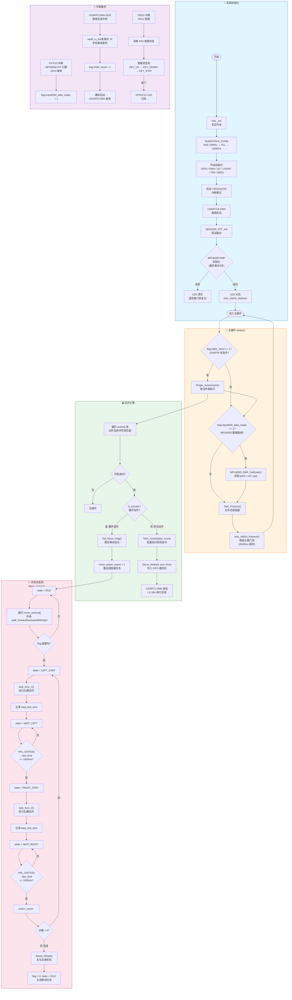

```mermaid
flowchart TD
    %% ==================== 系统初始化 ====================
    subgraph INIT["🚀 系统初始化"]
        direction TB
        A([开始]) --> B["HAL_Init<br/>复位外设"]
        B --> C["SystemClock_Config<br/>HSE 25MHz → PLL → 100MHz"]
        C --> D["外设初始化<br/>GPIO / DMA / I2C / USART / TIM / IWDG"]
        D --> E["启动 TIM10/11/4/5<br/>中断模式"]
        E --> F["USART1/6 DMA<br/>接收启动"]
        F --> G["SEGGER_RTT_Init<br/>调试输出"]
        G --> H{"MPU6050 DMP<br/>初始化<br/>(最多重试3次)"}
        H -->|失败| I["LED 熄灭<br/>饿死看门狗复位"]
        H -->|成功| J["LED 点亮<br/>HAL_IWDG_Refresh"]
        J --> K([进入主循环])
    end

    %% ==================== 主循环 ====================
    subgraph MAIN["🔄 主循环 while(1)"]
        direction TB
        K --> L{"flag.DMA_Send == 1?<br/>USART6 有指令?"}
        L -->|是| M["Single_Action(name)<br/>查动作表执行"]
        L -->|否| N{"flag.mpu6050_data_ready == 1?<br/>MPU6050 数据就绪?"}
        M --> N
        N -->|是| O["MPU6050_DMP_GetEuler()<br/>读取 pitch / roll / yaw"]
        N -->|否| P["Task_Process()<br/>合作式调度器"]
        O --> P
        P --> Q["HAL_IWDG_Refresh()<br/>喂独立看门狗<br/>(2048ms 超时)"]
        Q --> K
    end

    %% ==================== 中断服务 ====================
    subgraph ISR["⚡ 中断服务"]
        direction TB
        R["EXTI15 中断<br/>MPU6050 INT 引脚<br/>10ms 触发"] --> S["flag.mpu6050_data_ready = 1"]
        T["USART6 DMA IDLE<br/>接收完成中断"] --> U["uart6_rx_buf末尾补 '\0'<br/>字符串结束符"]
        U --> V["flag.DMA_Send = 1"]
        V --> W["重新启动<br/>USART6 DMA 接收"]
        X["TIM10 中断<br/>20ms 周期"] --> Y["读取 PA0 按键状态"]
        Y --> Z["按键状态机<br/>KEY_UP → KEY_DOWN → KEY_STAY"]
        Z -->|按下| AA["GPIOC13 LED<br/>闪烁"]
    end

    %% ==================== 动作引擎 ====================
    subgraph ACTION["🎬 动作引擎"]
        direction TB
        M --> AB["遍历 action[] 表<br/>动作名称字符串匹配"]
        AB --> AC{"匹配成功?"}
        AC -->|否| AD["无操作"]
        AC -->|是| AE{"is_circular?<br/>循环动作?"}
        AE -->|否 单次动作| AF["Take_Action(data, count)<br/>批量执行舵机指令"]
        AE -->|是 循环动作| AG["Set_Move_Flag()<br/>置位移动标志"]
        AF --> AH["Servo_Write(id, pos, time)<br/>写入 FIFO 缓冲区"]
        AH --> AI["USART1 DMA 发送<br/>LX-16A 串行总线"]
        AG --> AJ["move_action_active = 1<br/>激活调度器任务"]
    end

    %% ==================== 步态状态机 ====================
    subgraph GAIT["🦶 步态状态机<br/>Move_Action()"]
        direction TB
        AJ --> AK["state = IDLE"]
        AK --> AL["遍历 move_actions[]<br/>检查 walk_forward/backward/left/right"]
        AL --> AM{"flag 被置位?"}
        AM -->|否| AK
        AM -->|是| AN["state = LEFT_STEP"]
        AN --> AO["task_func_1()<br/>执行左脚动作"]
        AO --> AP["记录 step_last_time"]
        AP --> AQ["state = WAIT_LEFT"]
        AQ --> AR{"HAL_GetTick()<br/>- last_time<br/>>= 1000ms?"}
        AR -->|否| AQ
        AR -->|是| AS["state = RIGHT_STEP"]
        AS --> AT["task_func_2()<br/>执行右脚动作"]
        AT --> AU["记录 step_last_time"]
        AU --> AV["state = WAIT_RIGHT"]
        AV --> AW{"HAL_GetTick()<br/>- last_time<br/>>= 1000ms?"}
        AW -->|否| AV
        AW -->|是| AX["action_count--"]
        AX --> AY{"步数 > 0?"}
        AY -->|是| AN
        AY -->|否 完成| AZ["Reset_Whole()<br/>复位全身舵机"]
        AZ --> BA["flag = 0, state = IDLE<br/>关闭移动任务"]
    end

    %% ==================== 样式定义 ====================
    style INIT fill:#e1f5fe,stroke:#0277bd
    style MAIN fill:#fff3e0,stroke:#ef6c00
    style ISR fill:#f3e5f5,stroke:#7b1fa2
    style ACTION fill:#e8f5e9,stroke:#2e7d32
    style GAIT fill:#fce4ec,stroke:#c2185b
```